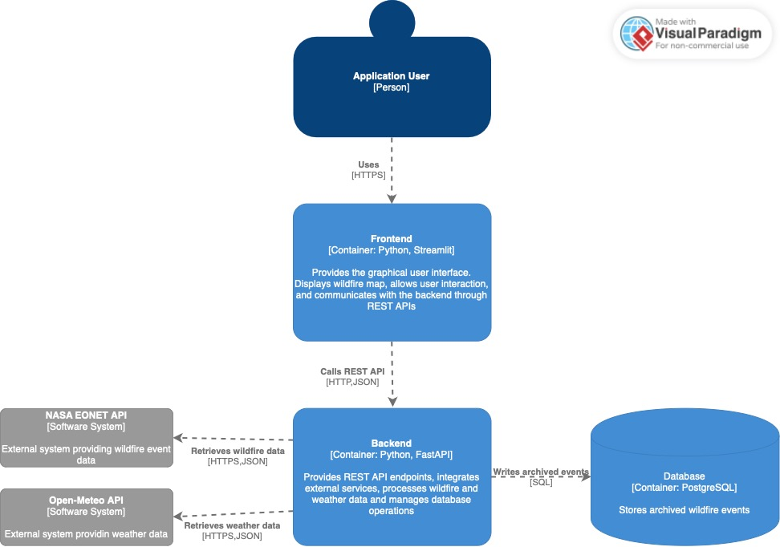

# Architekruta Systemów Informatycznych 2026

Zespół: Bartosz Ząbkowski Ola Choszczyk

Projekty prezentuje aplikację mobilną która miała za zadanie odpowiedzieć na pytanie czy obecność pożaru w danym miejscu na świecie wpływa na
odczyty temperatury średniej w ciągu dnia (zaciąganej z API open meteo). Pierwotnie nasza aplikacja miała umożliwiać przeglądanie
wystąpień susz,powodzi,pożarów oraz huraganów jednakże okazało się, że jedynie zjawisko pożarów jest na tyle częste, że nadaje się do wizualizacji.
API dostarczające informację odnośnie pożarów koncentruje się na tych wystepujących na terenie USA. Zdecydowaliśmy się użyć Streamlita ze względu na
na prostotę i szybkość tworzenia layoutu strony do aplikacji zorientowanej na wizualizacji dnaych.
Na interaktywnej mapie widoczne są wszystkie zdarzenia które zostały zakwalifikowane jako pożary z okresu 30 dni wstecz.
Po nakliknięciu na dane zdarzenie z mapy, wyświetla się u dołu wykres liniowy prezentujący zmianę średniej dniowej temperatury danego dnia
w przeciągu 30 dni od pożaru. Wykresy w żaden sposób nie prezentują anomalnych skoków temperaturowych w dniu w którym zarejestrowano pożar, co 
przemawia za tezą, że metodyka w jaki sposób wyznaczana jest temperatura a poźniej udostępniane przez API jest odporna na anormalne skoki temperaturowe
wywołane pożarem.

## Żródła danych

1) Kataklizmy: "https://eonet.gsfc.nasa.gov/api/v3/events"
2) Pogoda: "https://archive-api.open-meteo.com/v1/archive"

## Architektura rozwiązania 

